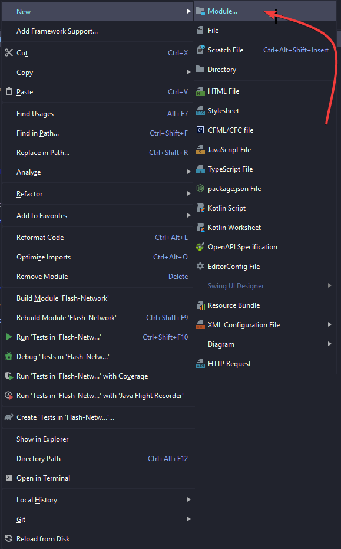
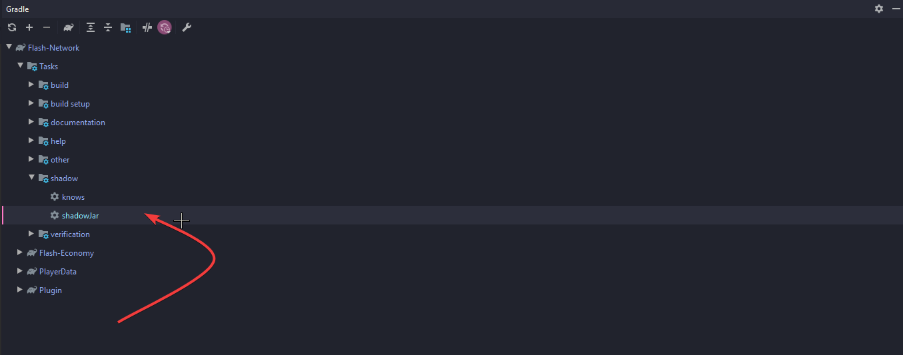

# How to setup the root project.

So firstly lets head over to the root `build.gradle` in there we will want to add a few specific things.

```kotlin
import com.github.jengelman.gradle.plugins.shadow.ShadowPlugin
import org.jetbrains.kotlin.gradle.plugin.KotlinPluginWrapper

plugins {
    kotlin("jvm") version "1.3.72"
    id("com.github.johnrengelman.shadow") version "5.2.0"
}

group = "com.example"
version = "1.0.0"

allprojects {
    apply<KotlinPluginWrapper>()
    apply<ShadowPlugin>()

    repositories {
        mavenCentral()
        mavenLocal()
    }

    tasks {
        shadowJar {
            configurations = listOf(project.configurations["shadow"])
            destinationDirectory.set(rootProject.file("./Server/plugins"))
        }

        compileKotlin {
            kotlinOptions.jvmTarget = "1.8"
        }

        compileTestKotlin {
            kotlinOptions.jvmTarget = "1.8"
        }
    }
}
```
Now the `destinationDirectory.set(rootProject.file("./Server/plugins"))` is just saying where the compiled jars will be sent to.
<br>
<br>
If you are familiar at all with gradle this will look very familiar to what you are used to already.

# How to set up a new module

To set up a new module first right click the root project and click the new module
<br>

After creating a new module, the basics are easy. Once the module has initialised and gradle has run it will throw errors thats fine. We're going to be focusing on **build.gradle** 

You will need to add the following code 
```kotlin
fun DependencyHandler.shadowApi(notation: Any) {
    shadow(notation)
    api(notation)
}

group = "com.example"
version = "1.0.0"

repositories {
    mavenCentral()
}

dependencies {
    shadowApi(kotlin("stdlib-jdk8"))
    compileOnly("org.spigotmc:spigot:1.16.1-R0.1-SNAPSHOT")
}
```

This little piece of code will handle your dependencies. 
<br>
Kotlin will always be placed under `shadowApi(kotlin("stdlib-jdk8")))`
<br>
<br>
Any depedencies you dont want shading into your plugin will be called under compileOnly()
<br>
If you are wanting to depend on an inner module you can do so by adding `compileOnly(project(":module_name_here"))`
<br>
<br>
<br>
# Compiling the jars

To compile the jars, on the right of IntelliJ you will have a tab **gradle**, open that tab and under the root project, find shadow. Then double-click shadowJar.
<br>
<br>
Completely ignore any modules you have, this is not how you shade nor do you need to worry about them. They will compile.
<br>

# After compiling

After you have run shadowJar and the jars have compiled they will be located under `$rootProject/jars/...`
<br>
<br>
Remember you will only need the module jars NOT `ROOT_PROJECT.jar` this jar is empty and does nothing. It is a useless jar.
<br>
Each jar file runs as its own plugin *(if configured that way)*.
<br>
<br>
<br>

Any issues welcome to ping me in discord or PM me. <br> **Furness#7921**

